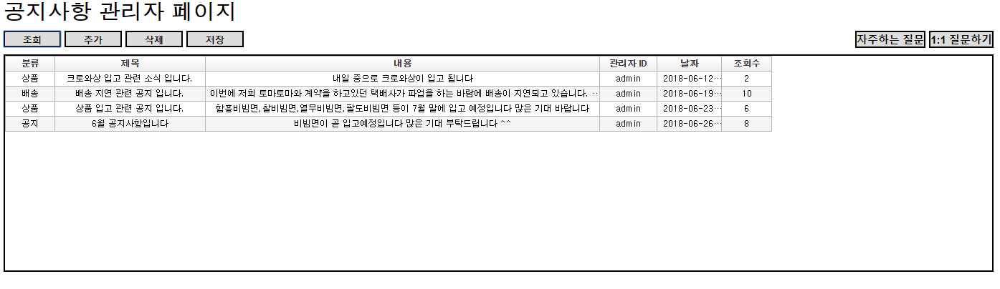
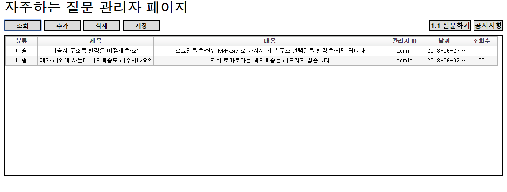
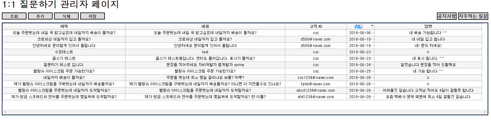

# Websquare 5를 활용한 TomaToma 고객센터 관리자 페이지
`---------------------------------------------------------------------------------------------------------------------------------`
## Develope Environment(개발 환경)
* #### UI : Websquare 5
* #### Back-End : Spring Boot (RestAPI)
* #### DB : Oracle
* #### IDE : Eclipse Mars, STS
* #### Tool : sqldeveloper

## 기능
* #### 조회, 추가, 수정, 삭제와 같은 기본적은 CRUD 기능
* #### 페이지 이동 기능

## Page Images
* #### 공지사항(Notice)

* #### 자주하는 질문(Faq)

* #### 1:1 질문하기(Qna)

